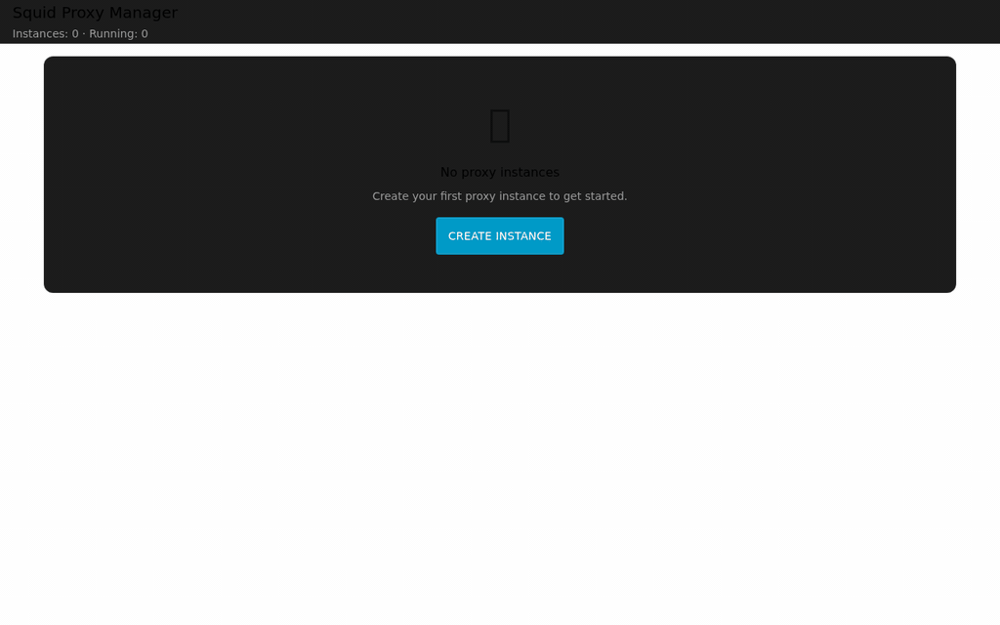
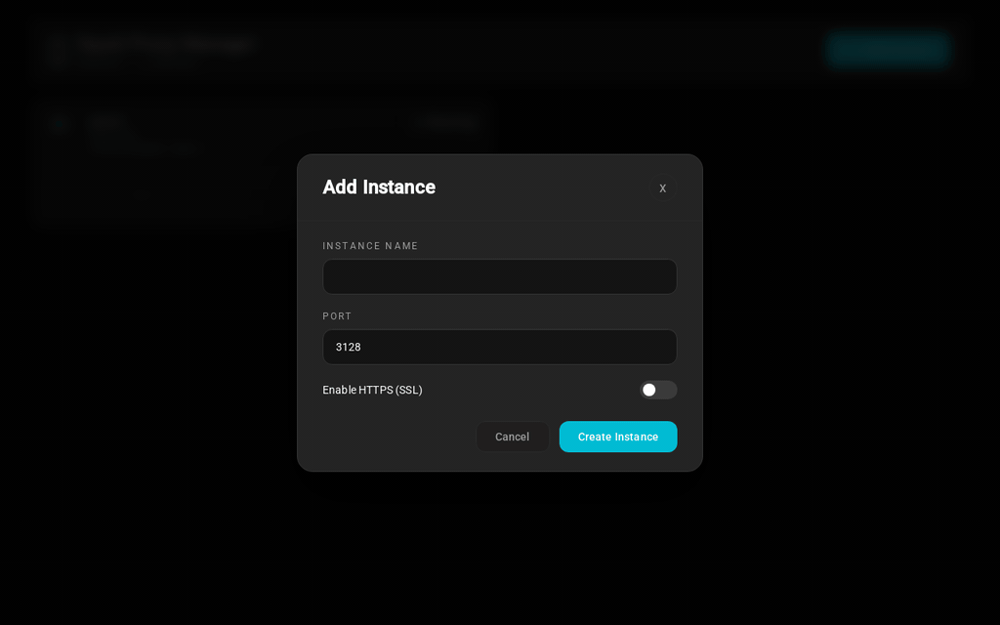

# HA Squid Proxy Manager

[](https://github.com/rbnkv/HA_SQUID_PROXY/actions/workflows/ci.yml)
[](https://opensource.org/licenses/MIT)

[](https://my.home-assistant.io/redirect/supervisor_add_addon_repository/?repository_url=https%3A%2F%2Fgithub.com%2Frybnikov%2FHA_SQUID_PROXY)

**Manage multiple Squid HTTP/HTTPS proxies with a beautiful web dashboard.** Create isolated proxy instances with independent user authentication, HTTPS support, and real-time monitoring—all from your Home Assistant instance.

Perfect for:
- 🔀 **Load balancing** traffic across multiple proxy servers
- 🏢 **Multi-tenant networks** with isolated users per proxy
- 🔒 **Secured connections** with HTTPS and user authentication
- 📊 **Traffic monitoring** with real-time access logs
- 🛡️ **Content filtering** at the proxy level

## What You Get

| Feature | Description |
|---------|-------------|
| ✅ Easy Web Dashboard | Create, manage, and monitor proxies without touching config files |
| ✅ Multiple Proxies | Run 1-13 isolated proxy instances simultaneously |
| ✅ User Authentication | Independent user accounts for each proxy instance |
| ✅ HTTPS Support | Enable encrypted proxy connections with auto-generated certificates |
| ✅ Live Logs | Monitor proxy traffic, search logs, and track requests |
| ✅ Persistent Storage | Your proxy configs survive add-on restarts |
| ✅ No Restart Required | Start, stop, and modify proxies instantly |

## Get Started in 60 Seconds

### Step 1: Install

1. Click the button above, or manually add repository: `https://github.com/rybnikov/HA_SQUID_PROXY`
2. Install "Squid Proxy Manager" from Add-on Store
3. Click "Start" and wait for "Started"
4. Click "Open Web UI"

### Step 2: Create Your First Proxy



Click **Add Instance** and fill in:
- **Name**: "office" (or any name — letters, numbers, dots, hyphens, underscores)
- **Port**: 3128
- **Toggle HTTPS**: Off for now

Click **Create Instance** — your proxy is running!

### Step 3: Add Users

Click the **gear icon** on your instance card (or click the card itself) to open settings. Scroll to **Proxy Users**:

- **Username**: alice
- **Password**: secure_password

Click **Add User** — users can now authenticate to your proxy. Each user is isolated per proxy.

### Step 4: Test It Works

```bash
# Test with authentication
curl -x http://localhost:3128 -U alice:secure_password http://google.com

# If it works, you'll see Google's HTML response
```

Done! Your proxy is running and authenticated.

## Features Showcase

### Dashboard — View All Proxies


See all running proxies with status indicators, port, HTTPS, and user count. Semantic start/stop buttons and clickable cards for quick settings access.

### HTTPS Proxy — Encrypted Connections



Enable HTTPS with auto-generated certificates. Manage certificates, add users, and test connectivity—all from the instance settings page.

## Real-World Use Cases

### Multi-Tenant Office Network
- Office staff on ports 3128 (with auth)
- Guest network on port 3129 (different users)
- Management on port 3130 (HTTPS + restricted)

Each group has isolated users. No cross-pollination.

### Load Balancing & Failover
- Run 3 proxy instances
- Route traffic across them
- If one fails, the others keep working

### Secure Remote Access
- Enable HTTPS on a proxy
- Create strong authentication
- Remote users connect securely
- Monitor who accesses what

### Content Filtering at Scale
- Multiple proxies with different policies
- Users assigned to specific proxies
- Each proxy can filter differently
- Monitor each one independently

## Technical Overview

**Behind the scenes:**
- **Web Server** (aiohttp): Dashboard + REST API on port 8099
- **Proxy Manager** (Python): Creates/manages Squid instances
- **Squid Proxies** (isolated): 1-13 independent processes per port
- **Storage** (/data): Configs, users, certs, logs (persistent across restarts)

Each proxy instance is **100% isolated**:
- Own configuration file
- Own user database
- Own HTTPS certificate (if enabled)
- Own access/cache logs
- Can be stopped/started independently

## Frequently Asked Questions

**Q: Can I run multiple proxies at the same time?**
Yes! You can run up to 13 proxies on different ports (3128-3140). Each is completely independent.

**Q: Do users share passwords across proxies?**
No. Each proxy has its own user database. "alice" on office-proxy is different from "alice" on remote-proxy.

**Q: Can I enable HTTPS on just one proxy?**
Yes. Some proxies can be HTTP, others HTTPS. Mix and match as needed.

**Q: What if I restart the add-on?**
All your proxy configurations, users, and logs are saved. They'll be back exactly as they were.

**Q: How do I use the proxy from my computer?**
Configure your app to use: `http://homeassistant:3128` (or the port you chose)
Enter username and password when prompted (if you added users).

**Q: Is this secure?**
Yes. Passwords are hashed (MD5-crypt), add-on runs non-root, HTTPS is supported. See Security section.

**Q: Can I monitor who's using my proxies?**
Yes. Each proxy has access logs showing client IP, timestamp, URL, response status. Real-time search available.

## Technical Specs

| Feature | Details |
|---------|---------|
| **Max Proxies** | 1-13 per container (ports 3128-3140) |
| **Port Range** | 3128-3140 (configurable per instance) |
| **Authentication** | MD5-crypt htpasswd (Squid standard) |
| **HTTPS Certs** | Self-signed, auto-generated, 365-day validity |
| **Users per Proxy** | Unlimited |
| **Ports Used** | 8099 (web dashboard) + proxy ports |
| **Storage** | Persistent /data volume |
| **Restart Behavior** | All configs preserved |
| **CPU/Memory** | ~50MB base + ~20MB per proxy instance |

## Compatibility

- **Home Assistant**: 2024.1.0+
- **Docker**: Required
- **Network**: Proxies must be accessible from client devices

## Support & Troubleshooting

**Issue: "Connection Refused" when testing proxy**
- Verify the instance is running (shows "Running" badge)
- Check you're using the correct port (default 3128)
- Verify port forwarding if accessing remotely

**Issue: "407 Proxy Authentication Required"**
- This is normal! It means authentication is required
- Click the gear icon on your instance card → scroll to Proxy Users
- Use correct username:password in your proxy settings

**Issue: HTTPS shows certificate warning**
- This is expected! Self-signed certificates always warn
- The connection is encrypted, just untrusted
- Use `--proxy-insecure` in curl or accept the warning in your browser

**Issue: Can't reach proxy from another device**
- Port forwarding must be configured
- Firewall rules must allow proxy port (3128, 3129, etc.)
- Device must be on same network or have port forwarding

For more help, see [REQUIREMENTS.md](REQUIREMENTS.md) for detailed scenarios and [DESIGN_GUIDELINES.md](DESIGN_GUIDELINES.md) for UI documentation.

## Development Environment (Full HA Official Frontend Mode)

This repo now includes a setup script to align with Home Assistant official frontend development mode:
- https://developers.home-assistant.io/docs/frontend/development

### Prerequisites

- Visual Studio Code + Dev Containers extension
- Docker Engine / Docker Desktop
- Git

### Quick Start

1. Clone Home Assistant Core and frontend as sibling folders:
   - `git clone https://github.com/home-assistant/core.git ../core`
   - `git clone https://github.com/home-assistant/frontend.git ../frontend`
2. Run setup from this repo:
   - `./setup_ha_official_frontend_dev_mode.sh`
3. Open `../core` in VS Code and reopen in devcontainer.
4. In Core devcontainer:
   - run frontend watcher in `/workspaces/frontend`
   - run Home Assistant Core and open `http://localhost:8123`

Important: visual parity for `ha-*` components must be validated in HA context (`:8123`), not only standalone `:8099`.
