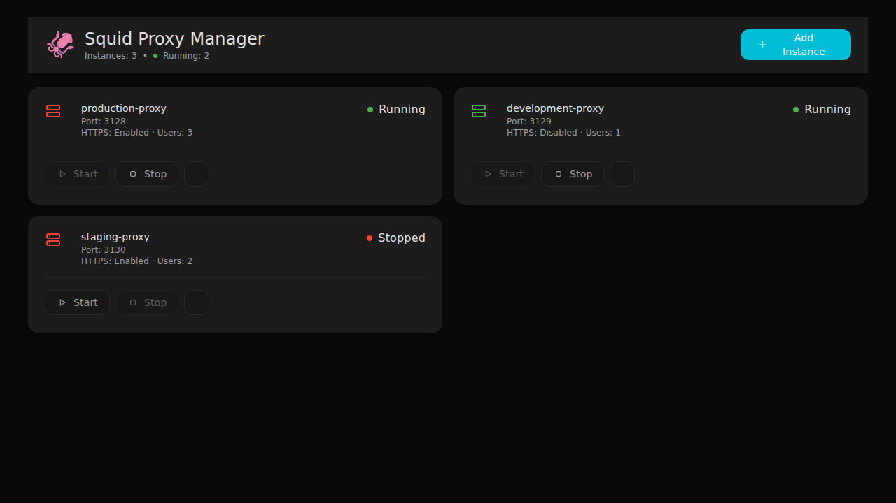
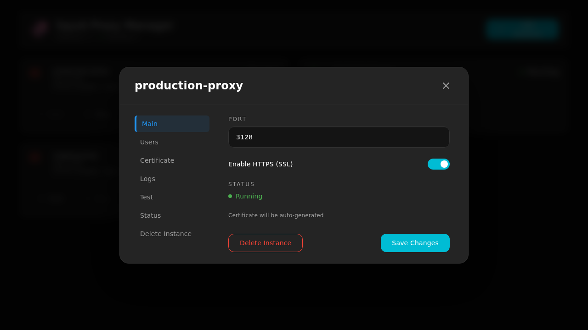

# Frontend Mock Mode Screenshots

This folder contains screenshots demonstrating the frontend running in mock mode without backend dependencies.

## Mock Mode Dashboard



**Features shown:**
- 3 pre-populated proxy instances
- Instance status indicators (Running/Stopped)
- Port and HTTPS configuration display
- User count for each instance
- Start/Stop/Settings controls

## Mock Mode Proxy Settings



**Features shown:**
- Proxy configuration modal
- Port configuration (3128)
- HTTPS toggle (enabled)
- Instance status (Running)
- Delete and Save controls
- Tab navigation (Main, Users, Certificate, Logs, Test, Status)

## How to Generate These Screenshots

```bash
# 1. Start frontend in mock mode
./run_frontend_for_agent.sh

# 2. Connect with Playwright or open browser
# Navigate to: http://localhost:5173

# 3. Capture screenshots
# - Dashboard: Main page
# - Settings: Click Settings button on any instance

# 4. Stop server
./run_frontend_for_agent.sh --stop
```

## Mock Data

All mock data is defined in `squid_proxy_manager/frontend/src/api/mockData.ts`:
- 3 sample instances with different configurations
- User lists per instance
- Certificate information
- Sample logs

See [DEVELOPMENT.md](../../DEVELOPMENT.md#frontend-development-with-mock-mode) for full mock mode documentation.
